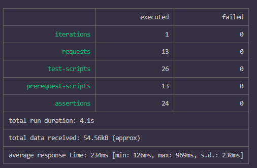
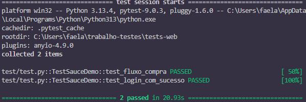
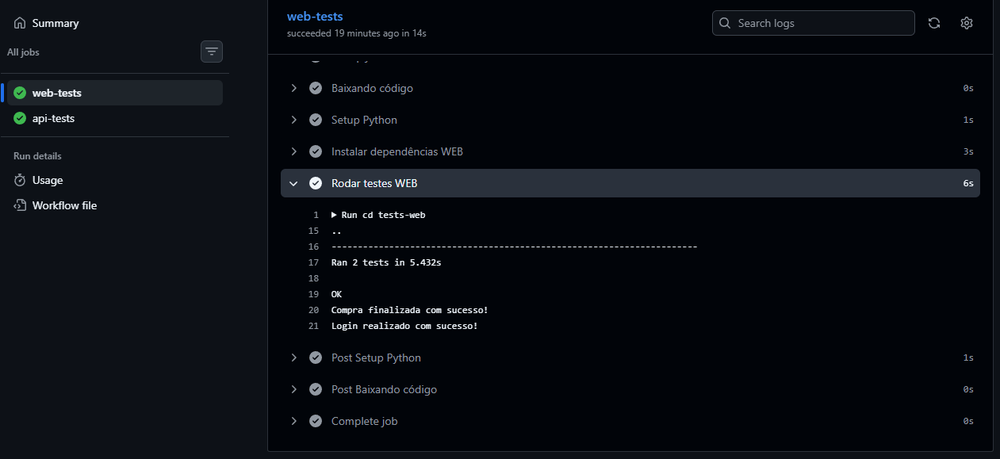
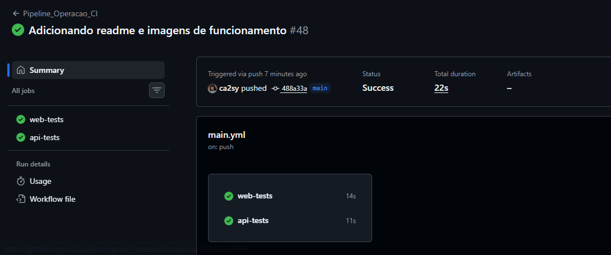

# Pipeline de Testes Automatizados — Petstore & SauceDemo
 
Projeto acadêmico de automação de testes, contemplando testes de API REST e testes end-to-end (E2E) de interface web, integrados em uma pipeline de integração contínua com GitHub Actions.
 
---
 
## Estrutura do Projeto
 
```
.
├── .github/
│   └── workflows/
│       └── pipeline.yml
├── tests-api/
│   └── Teste-Automacao-Petstore.json
├── tests-web/
│   ├── pages/
│   │   ├── login_page.py
│   │   ├── produtos_page.py
│   │   ├── carrinho_page.py
│   │   └── checkout_page.py
│   ├── test/
│   │   └── test.py
│   └── requirements.txt
└── README.md
```
 
---
 
## Testes de API — Petstore
 
Os testes de API utilizam a API pública do [Swagger Petstore](https://petstore.swagger.io/) e foram criados no **Postman**, exportados como coleção JSON e executados via **Newman** (CLI do Postman).
 
### Cobertura atual
 
**Pet**
- ✅ Criar pet (`POST`) — valida status 200 e nome
- ✅ Atualizar pet (`PUT`) — valida alteração do nome
- ✅ Buscar por status (`GET`) — valida retorno como lista e ausência do pet atualizado
- ✅ Buscar por ID (`GET`) — valida ID e nome
- ✅ Deletar pet (`DELETE`) — valida status 200
**Store**
- ✅ Criar pedido (`POST`) — valida status 200, status do pedido, ID e tipos de dados
- ✅ Buscar pedido (`GET`) — valida ID e status do pedido
- ✅ Deletar pedido (`DELETE`) — valida status 200
**User**
- ✅ Criar usuário (`POST`) — valida status 200
- ✅ Buscar usuário (`GET`) — valida username e estrutura da resposta
- ✅ Login (`GET`) — valida sucesso e mensagem retornada
- ✅ Logout (`GET`) — valida status 200
- ✅ Deletar usuário (`DELETE`) — valida status 200
---
 
## Testes E2E — SauceDemo
 
Os testes web simulam o fluxo completo de compra no sistema [SauceDemo](https://www.saucedemo.com/), utilizando **Selenium WebDriver** com Python e o padrão **Page Object Model (POM)**.
 
### Fluxo validado
 
1. Acesso ao sistema
2. Login com usuário válido
3. Adição de produto ao carrinho
4. Navegação para o carrinho
5. Início do checkout
6. Preenchimento dos dados
7. Finalização da compra
8. Validação da mensagem de sucesso

### Validações realizadas
 
- ✅ Login bem-sucedido (verificação de URL)
- ✅ Produto adicionado ao carrinho (badge = 1)
- ✅ Presença de item no carrinho
- ✅ Navegação correta entre páginas
- ✅ Mensagem final: `"Thank you for your order!"`
### Padrão de Projeto — Page Object Model (POM)
 
O projeto separa a lógica de interação com a interface (pages) da lógica de validação (testes):
 
| Arquivo | Responsabilidade |
|---|---|
| `login_page.py` | Ações de autenticação |
| `produtos_page.py` | Manipulação de produtos e carrinho |
| `carrinho_page.py` | Operações no carrinho |
| `checkout_page.py` | Fluxo de checkout e validação |
 
---
 
## Execução Local
 
### Pré-requisitos
 
- Python 3.10+
- Node.js 20+
- Google Chrome
### Testes de API
 
```bash
npm install -g newman
cd tests-api
newman run Teste-Automacao-Petstore.json
```
 
### Testes Web
 
```bash
cd tests-web
pip install -r requirements.txt
PYTHONPATH=. python -m test.test
```
 
### Variáveis de ambiente (testes web)
 
Crie um arquivo `.env` na pasta `tests-web/` com o seguinte conteúdo:
 
```env
SAUCE_USERNAME=standard_user
SAUCE_PASSWORD=secret_sauce
SAUCE_URL=https://www.saucedemo.com/
```
 
---
 
## Pipeline CI/CD — GitHub Actions
 
A pipeline é executada automaticamente a cada push na branch `main`.
 
### Jobs
 
Dois jobs independentes são executados em paralelo:
 
| Job | Descrição |
|---|---|
| `web-tests` | Executa os testes E2E com Selenium em modo headless |
| `api-tests` | Executa os testes de API com Newman |
 
### Características
 
- Execução em ambiente Ubuntu
- Navegador Chrome em modo headless
- Uso de variáveis de ambiente para credenciais
- Isolamento entre testes web e API
---
 
## Tecnologias Utilizadas
 
| Tecnologia | Uso |
|---|---|
| Python 3.10 | Linguagem dos testes web |
| Selenium WebDriver | Automação de interface |
| unittest | Framework de testes |
| Postman / Newman | Criação e execução dos testes de API |
| GitHub Actions | Pipeline de integração contínua |
| Google Chrome (headless) | Navegador nos ambientes de CI |
 
---

 
## Evidências de Execução
 
### Testes de API — Newman
 

> Resultado da execução da coleção Postman via Newman no terminal.
 
### Testes Web — Selenium
 

> Execução dos testes E2E validando o fluxo completo de compra no SauceDemo.

### CI/CD 





 
---

 